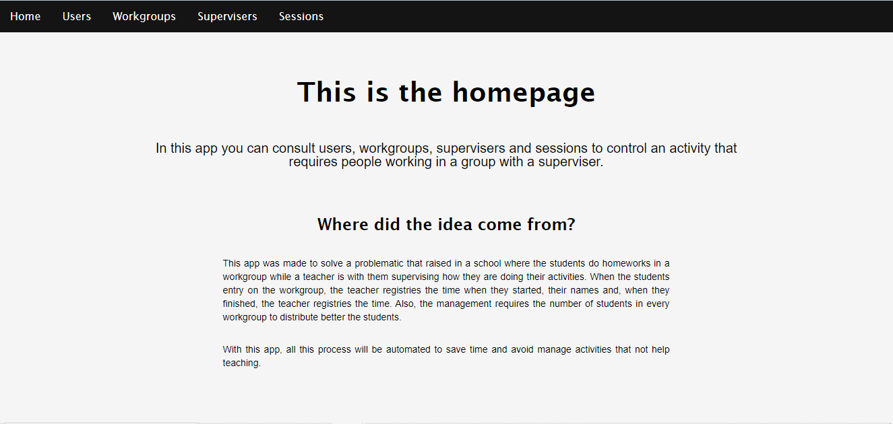

# QR Registration

## About this project

This project can generate a registration with a QR code. The objective is resgistry people that start a work session with a group or a person, with this project the control of people in work groups will be more efficient and easy to do.

## Project tasks

## Stage 1. Project’s design

### Flow of the app

In this section the information of the design stage is referenced. The first step of the develop is create a flow diagram that proposes the main process that the app will follow.

[Flow diagram](QR-Registration-Documentation/Flow%20diagram%208ae726e180234475bb0bd7e0ddc48107.md)

### Database design

With the flow diagram created, the next step is create the ER diagram to specify how the entities of the project are relationated.

[ER Diagram](QR-Registration-Documentation/ER%20Diagram%207b792302cd90416386e37090e914052f.md)

### API design

The next step is create a the endpoints that the API will have and the task that every one will do. The follow page has this specifications.

[API design](QR-Registration-Documentation/API%20design%20ffd4339e6a5541fe95a4cc55d64ffa4b.md)

## Stage 2. Project implementation

This stage consist in the implementation of the project, the next part explains about the diferent created pages of a website that do the principal activities of the project.

### Home page (/home)

This page has an introduction about the project.

### Users page (/users)

This page shows the different users that are registered in the app. In this page the search by id, delete user, create user and join user to a group are available .

### Workgroups page (/workgroups)

This page permits get all the workgroups, create workgroups, get users in a workgroup and delete workgroups.

### Supervisers page (/supervisers)

This page permits get all the supervisers, search a superviser by id, create a superviser and delete supervisers.

### Sessions page (/sessions)

This page shows all the sessions created in the app and user’s session, it can delete sessions too.

### Mobile Register (/mobile)

This page is intented to be open in a mobile to scan the QR codes that every user will have. When the ID is detected, is selected the workgroup’s id and pressed “Add” to incorporate a user in a workgroup. This change can be seen in the workgroups page, in the users in a workgroup section. 

Here can be seen the user added to this workgroup.

